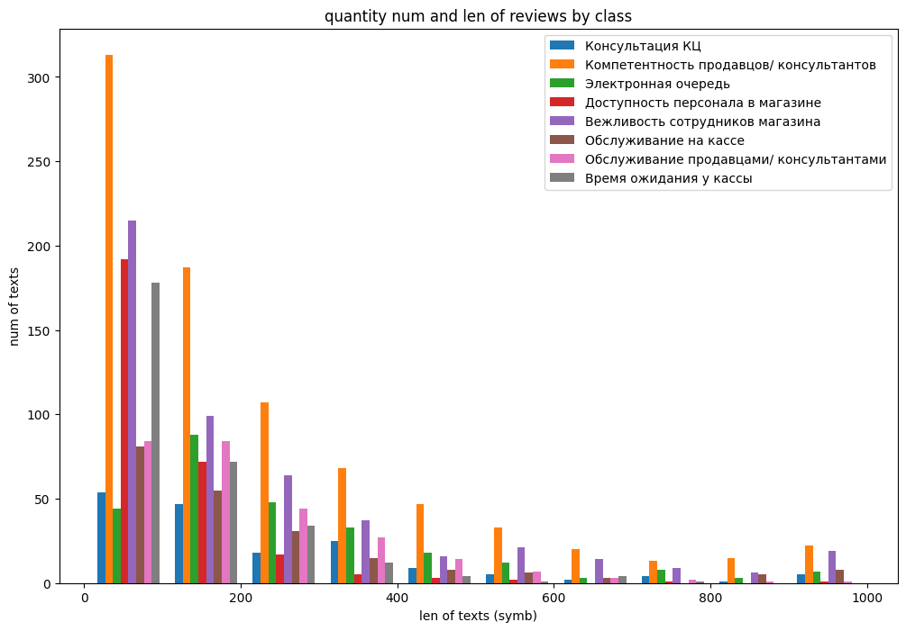
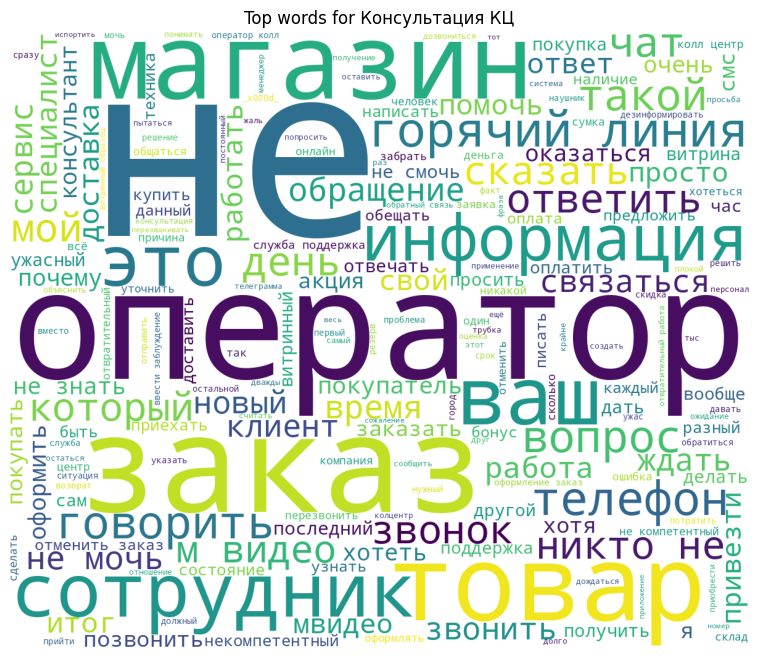
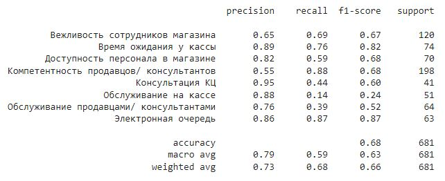

# project_mtech

## Постановка задачи
Дан датасет из 2937 отзывов, разбитых на 8 классов. Необходимо создать и обучить модель, которая с максимальным f1 score будет классифицировать новые отзывы. 
На выполнение дано 3 дня. 

## Сделано
- Исследование датасета 

- Проведена очистка текста, в т.ч. с вниманием к тому, как очистка (например, чисел) влияла на финальную точность модели
  - Стемминг/лемматизация (не слишком влияли на производительность, но лемматизация давала небольшой прирост точности -> лемматизацию оставила)  
- Разбиение выборки на тест, трейн, валид
- Бейзлайн (naive bayes, 0.67 f1 мера на валидационной выборке)
- Были найдены ключевые слова, которые чаще всего влияли на принадлежность отзыва к классу
	- Проценты классов после выбора нескольких ключевых стемм: 
		- Консультация КЦ 47.77 
		- Компетентность продавцов/ консультантов 21.02 
		- Вежливость сотрудников магазина 12.42 
		- Обслуживание продавцами/ консультантами 7.64 
		- и т.д.

- Были добавлены доп. фичи: эмоциональная окраска (ненормативная лексика, наличие большого кол-ва знаков препинания)
- Добавление N-gramm улучшило точность
- По результатам построены Confusion Matrix, Cloud of Words для визуализации

![\[\[conf_matrix_table.jpg\]\]](media/confusion_matrix.png)
- Модель была сохранена при помощи joblib, подготовлен скрипт для автоматического запуска модели

 Модель | Лемматизация | Стемминг | Без лемм | Что использовалось
------------ | ------------ | ------------  | ------------ | ------------
NB | 68.36 | 67.03 | - | lower, rm_punkt, rm_stop, rm_eng, rm_numb
NB-II | ==68.86== | 68.20 | - | lower
NB + TF-IDF | 64.31 | 62.22 | - | lower, rm_punkt, rm_stop, rm_eng, rm_numb
NB + n-gramms(3) | - | - | 73.53 | lower, (rm_punkt 73.01)
SVM (SVC) + TF-IDF | ==75.93== | - | - | lower, rm_punkt, rm_stop, rm_eng, rm_numb
SVM (SVC) | 73.47 | - | - | lower-only
RF + TF-IDF | 72.97 | - | - | lower, rm_punkt, rm_stop, rm_eng, rm_numb
SVM + n-gramms(4/3) | - | - | 77.79/79.95 | lower
SVM + n-gramms(3) | 75.74 | - | ==80.31== | lower,  rm_punkt
NN | | | 69.8 |
* f1_score * 100 для упрощения восприятия
* rm_punkt, rm_stop, rm_eng, rm_numb - удалены пунктуация, стоп-слова, английские слова и цифры соответственно. 